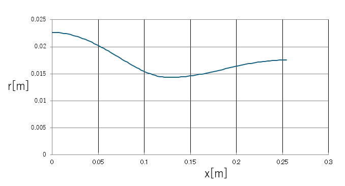
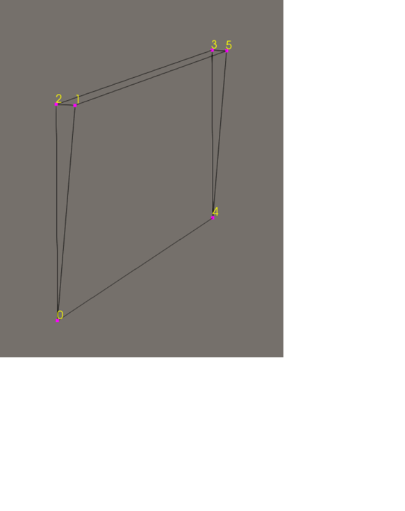
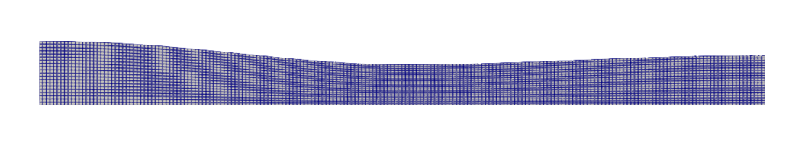
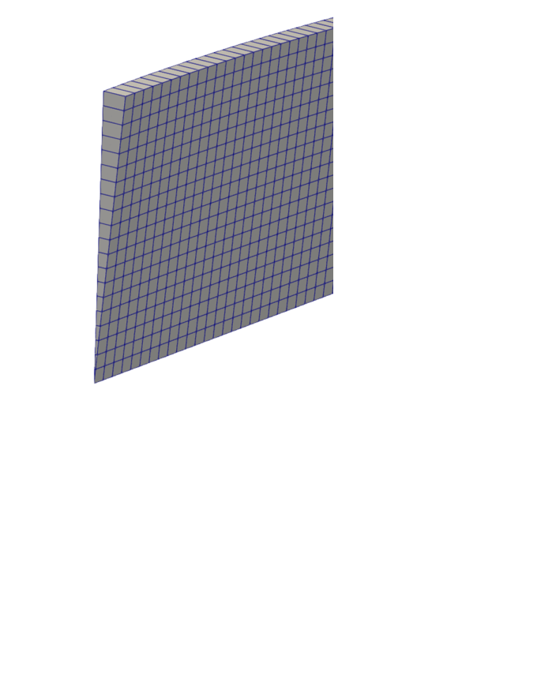

# blockMeshを使ったメッシュ作成


## ノズル形状

OpenFOAMの軸対称モデルを使って計算を行う。ここでは blockMeshを使ってメッシュを作成する。
ラバルノズルは先細-末広形状となっており形状を以下の式で表現する。

```fortran
    if ( x .lt. 5.0 ) then
      area = 1.75 - 0.75 * cos( ( 0.2 * x - 1.0 ) * pi )
    else
      area = 1.25 - 0.25 * cos( ( 0.2 * x - 1.0 ) * pi )
    endif
```
注：ここで  $0 \le x \le 10 [inch]$




## blockMeshDictの作成

以下のblockMeshDictを作成する。
ノズルの壁面形状は codeStream で記述している。blockMeshDict内で定義された
パラメータをソースプログラム内で参照することができる（ここでは ndivを使用）。

```
/*--------------------------------*- C++ -*----------------------------------*\
| =========                 |                                                 |
| \\      /  F ield         | OpenFOAM: The Open Source CFD Toolbox           |
|  \\    /   O peration     | Version:  v2312                                 |
|   \\  /    A nd           | Website:  www.openfoam.com                      |
|    \\/     M anipulation  |                                                 |
\*---------------------------------------------------------------------------*/
FoamFile
{
    version     2.0;
    format      ascii;
    class       dictionary;
    object      blockMeshDict;
}
// * * * * * * * * * * * * * * * * * * * * * * * * * * * * * * * * * * * * * //

mergeType points;   // Wedge geometry - Merge points instead of topology

scale   0.0254;

L      10;
ang    ${{ 2.5*3.14159265358979/180.0 }};
cs     ${{ cos($ang) }};
sn     ${{ sin($ang) }};
rin    0.892062058076386;
rout   0.690988298942671;

yin   ${{ $rin*$cs }};
zin   ${{ $rin*$sn }};

yout  ${{ $rout*$cs }};
zout  ${{ $rout*$sn }};

ndiv  200;


vertices
(
    ( 0   0   0)          // 0
    ($L   0   0)          // 1
    ( 0   $yin   -$zin)   // 2
    ($L   $yout  -$zout)  // 3
    ( 0   $yin    $zin)   // 4
    ($L   $yout   $zout)  // 5
);

blocks
(
    hex (0 1 3 2 0 1 5 4) ($ndiv  20  1) simpleGrading (1 1 1)
);

edges #codeStream
{
    codeInclude
    #{
        #include "pointField.H"
        #include "mathematicalConstants.H"
    #};

    code
    #{
        constexpr scalar xMin = 0;
        constexpr scalar xMax = 10;
        constexpr label nPoints = $ndiv + 1;
        constexpr scalar dx = (xMax - xMin)/scalar(nPoints - 1);
        constexpr scalar pi = constant::mathematical::pi;

        scalar cs = cos(2.5*pi/180.0);
        scalar sn = sin(2.5*pi/180.0);

        os  << "(" << nl << "spline 2 3" << nl;
        pointField profile(nPoints);

        for (label i = 0; i < nPoints; ++i)
        {
            scalar x = xMin + i*dx;
            scalar r(0.0);
            if ( x < 5.0 ) {
              scalar area ( 1.75 - 0.75 * cos( ( 0.2 * x - 1.0 ) * pi ) );
              r = sqrt(area/pi);
            }
            else {
              scalar area ( 1.25 - 0.25 * cos( ( 0.2 * x - 1.0 ) * pi ) );
              r = sqrt(area/pi);
            }
            profile[i].x() = x;
            profile[i].y() = r*cs;
            profile[i].z() =-r*sn;
        }
        os << profile << nl;

        os << "spline 4 5" << nl;
        for (label i = 0; i < nPoints; ++i)
        {
            scalar x = xMin + i*dx;
            scalar r(0.0);
            if ( x < 5.0 ) {
              scalar area ( 1.75 - 0.75 * cos( ( 0.2 * x - 1.0 ) * pi ) );
              r = sqrt(area/pi);
            }
            else {
              scalar area ( 1.25 - 0.25 * cos( ( 0.2 * x - 1.0 ) * pi ) );
              r = sqrt(area/pi);
            }
            profile[i].x() = x;
            profile[i].y() = r*cs;
            profile[i].z() = r*sn;
        }
        os << profile << nl;

        os  << ");" << nl;
    #};
};

boundary
(
    inlet
    {
        type patch;
        faces
        (
            (0 2 4 0)
        );
    }

    outlet
    {
        type patch;
        faces
        (
            (1 3 5 1)
        );
    }

    wall
    {
        type wall;
        faces
        (
            (2 4 5 3)
        );
    }

    wedge1
    {
        type wedge;
        faces
        (
            (0 2 3 1)
        );
    }

    wedge2
    {
        type wedge;
        faces
        (
            (0 1 5 4)
        );
    }
);

mergePatchPairs
(
);

// ************************************************************************* //
```

pointの配置は以下のようになっている。軸対称モデルなので全体は楔形形状である(中心角=5[deg])。




## blockMeshの実行

ケースディレクトリ内で blockMeshとタイプすることでメッシュが作成される。ただし、標準設定の
ままだと以下のような警告メッセージがたくさん出力される（メッシュはできているぽい）

```
--> FOAM Warning :
    From virtual void Foam::wedgePolyPatch::calcGeometry(Foam::PstreamBuffers&)
    in file meshes/polyMesh/polyPatches/constraint/wedge/wedgePolyPatch.C at line 73
    Wedge patch 'wedge2' is not planar.
At local face at (0.253364 0.0170957 0.000746413) the normal (-7.04761e-07 -0.0436194 0.999048) differs from the average normal (-2.02391e-10 -0.0436194 0.999048) by 4.97371e-13
Either correct the patch or split it into planar parts
```

この警告を抑制するためには、 system/controlDict の writePrecisionの数値を大きくする。例えば

```
writePrecision  10;    // increased 6 -> 10
```

最終的なメッシュは以下のようになる。



流入境界付近の拡大図を以下に示す。




