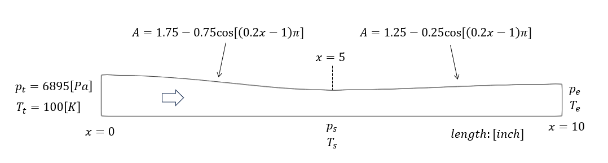

# OpenFOAMを使った解析

[ラバルノズルの検証例題](https://www.grc.nasa.gov/WWW/wind/valid/cdv/cdv.html)を参考にして解析を実施した。ソルバーは rhoCentralFoam を使用した。

## 解析モデル

解析モデルは以下の通りである。

## メッシュ分割

blockMeshを使い、[メッシュを作成](./mesh/meshing.md)した。

## 解析ケース

出口圧力を変えて３ケース実施した。

| case | $p_e/p_t$ | content  |
|:----:|:---------:|:---------|
| 1    |  0.89     | subsonic |
| 2    |  0.75     | shock wave |
| 3    |  0.16     | sub -> super sonic |

ここで $p_e$は出口圧力、$p_t$はよどみ点圧力(流入条件)である。

case-1 : [pe=0.89の解析](./pe-0.89/pe089.md)

case-2 : [pe=0.75の解析](./pe-0.75/pe075.md)

case-3 : [pe=0.16の解析](./pe-0.16/pe016.md)

