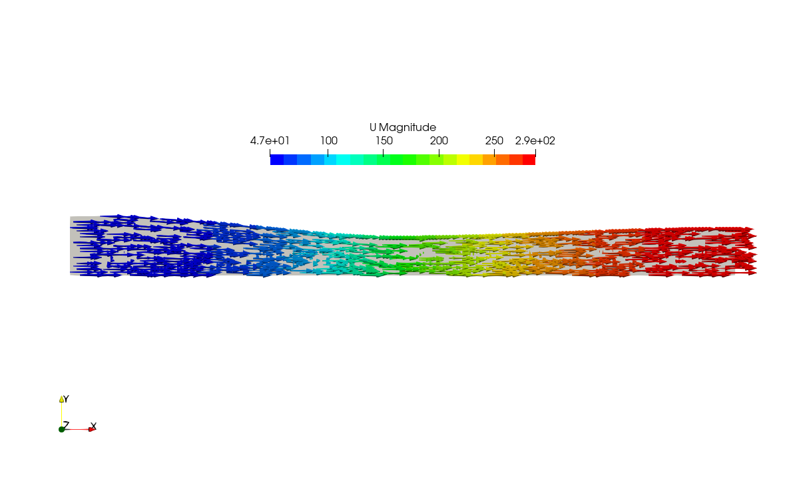
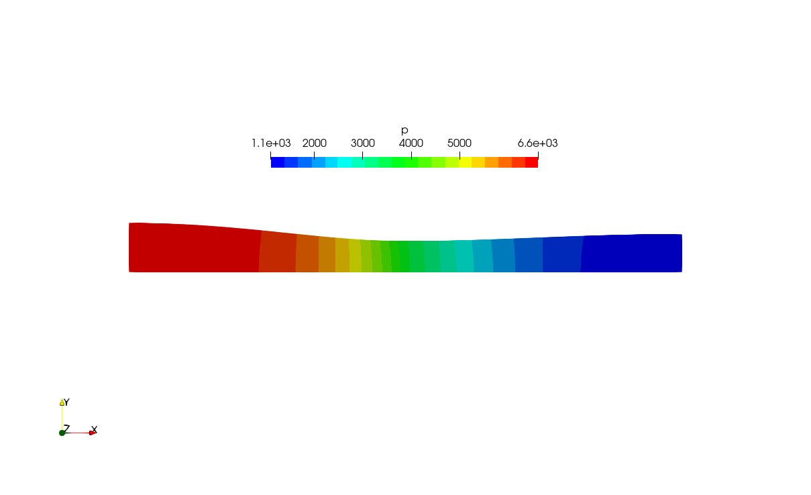
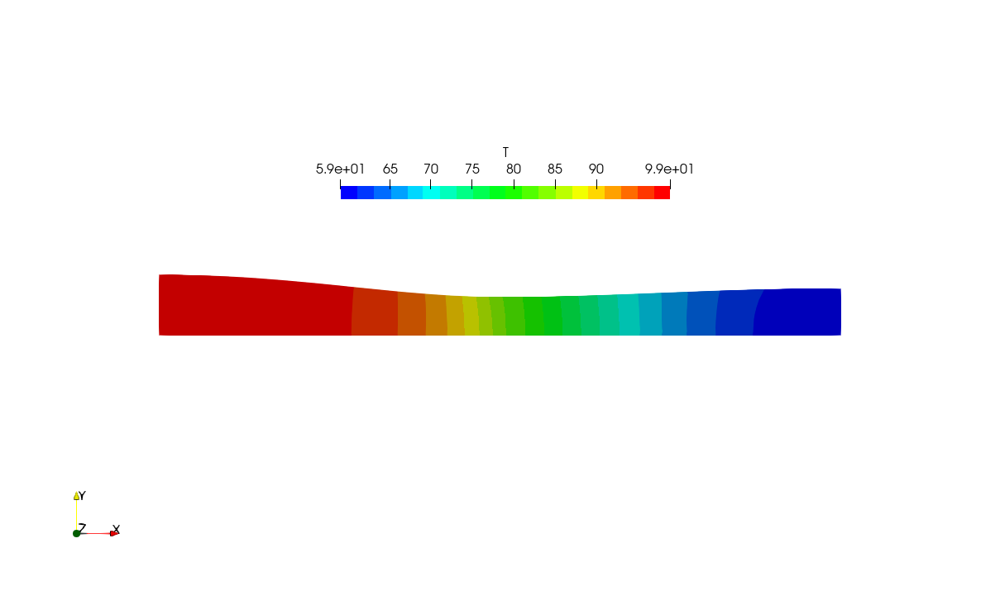
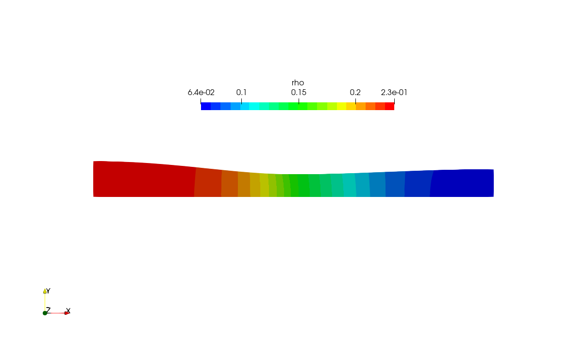
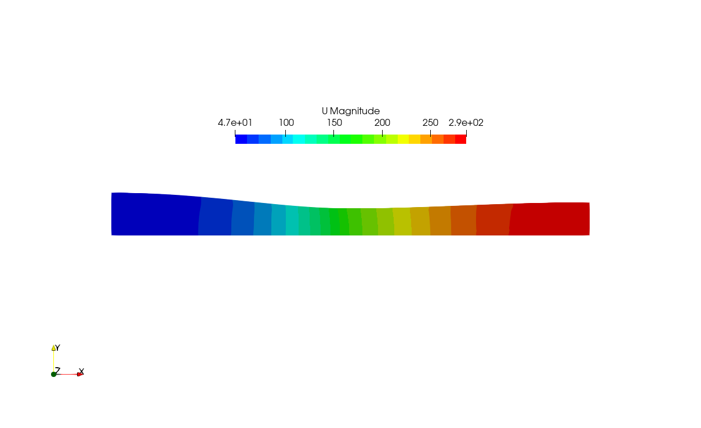
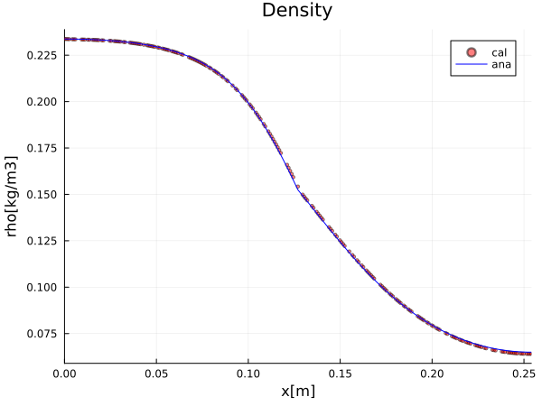
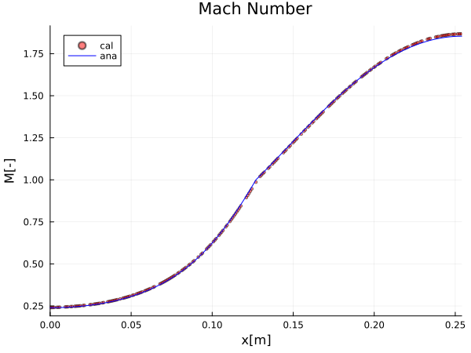
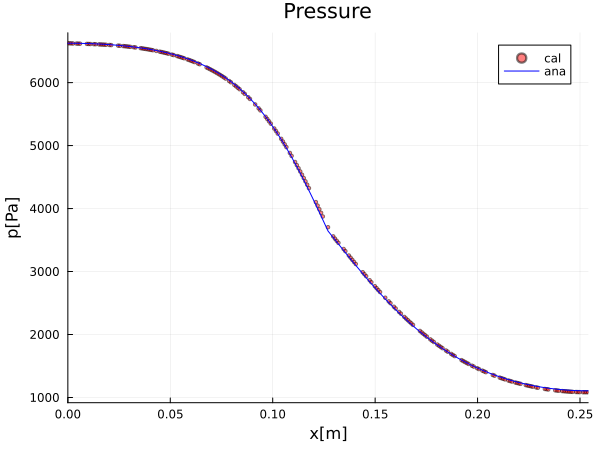
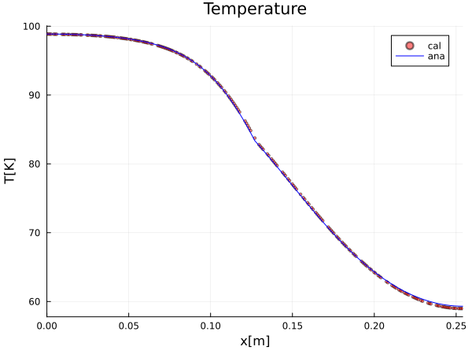
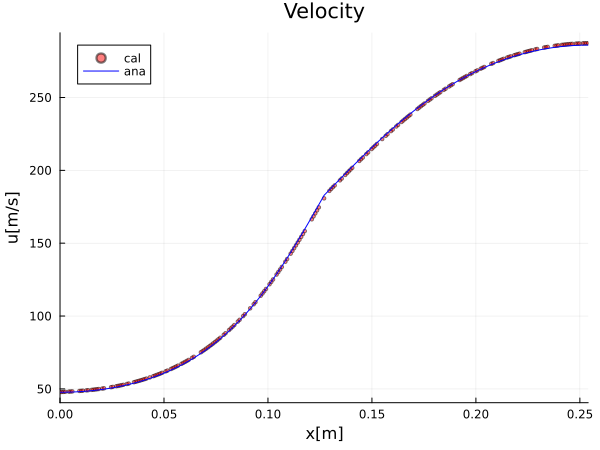

# $p_e/p_t=0.16$の計算

## 条件設定

### 物性値
密度＝理想気体、粘度、熱伝導率はゼロ、比熱$c_p=1005[J/kg/K]$、分子量$M_w=29\times10^{-3}[kg/mol]$

### 境界条件
出口圧力勾配がゼロ(zeroGradient)

## 解析結果

非定常で解析を行う。いくつかの検査点を設置し解変数の変動をモニターし、解変数が不変となった時点で定常状態になったと判断し計算を終了した。
解析結果は以下のようになった。

これらの計算結果の妥当性を調べるため、
[理論解](https://github.com/win-sugar/ghblog-laval-nozzle/blob/main/theory/theory.md)との比較を行った。

理論解分布を計算するためのjuliaプログラムを以下に示す。

[物理量の計算(profile.jl)](./profile.jl)

[xyプロット作画プログラム(plot.jl)](./plot.jl)

