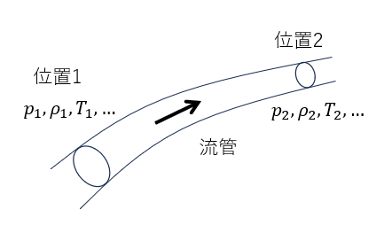

# 2. ラバルノズルを通過する流れの理論解

ラバルノズルとは先細末広タイプのノズルであり、超音速流れを加速するために使用される装置である。形状は単純であるが、流体の非線形効果により境界条件に依存して流れの様子が大きく変化する。

典型的なラバルノズル内の流れの様子を以下の図に示す。貯気槽(reservoir)から供給されたガスは inletからノズル内に流入し、outletから流出する。流路断面積は中央部で最小となるような形状となっており、最小断面位置はthroatと呼ばれる。

流出境界(outlet)での圧力$`p_0`$が流入境界(inlet)の圧力$`p_e`$と等しい場合は流体は静止している（図中の曲線a）。
outletでの圧力$`p_e`$を下げると流れが生じる。圧力低下量が小さい場合には領域全体で亜音速状態で流れる（図中の曲線b）。

outletでの圧力をさらに下げるとある時点でthroat点でのマッハ数が１に到達する（図中の曲線c)。

outletでの圧力をさらに下げるとthroatを通過する流れは超音速となるが、流出境界付近ではまだ亜音速状態のままとなっておりノズル内に垂直衝撃波が発生する（図中の曲線d)。

outletでの圧力をさらに下げると最終的にはthroatから下流側が全て超音速流れになる。なおthroatでのマッハ数が1になると流れはチョーク状態となるため、outletでの圧力を下げても流量は不変となる。

理論解を導出する際に使用する方程式を記述する

## 2.1. 一様エントロピー関係式

これは圧縮性流体の運動方程式から導かれる式であり、非圧縮性流体のベルヌイの式に対応している。流管上の任意の２点間には以下の関係式が成り立つ。ここで$`\gamma`$は比熱比、$`M`$はマッハ数、$`p`$は圧力、$`T`$は温度、$`\rho`$は密度、$`u`$は流速、$`A`$は流路断面積を表す。

$$
\begin{align}
\frac{p_1}{p_2}&=\left[
\frac{1+\frac{\gamma-1}{2}M_1^2}
{1+\frac{\gamma-1}{2}M_2^2}
\right]^{\frac{-\gamma}{\gamma-1}} \tag{1} \\
\frac{T_1}{T_2}&=\left[
\frac{1+\frac{\gamma-1}{2}M_1^2}
{1+\frac{\gamma-1}{2}M_2^2}
\right]^{-1}   \tag{2}  \\
\frac{\rho_1}{\rho_2}&=\left[
\frac{1+\frac{\gamma-1}{2}M_1^2}
{1+\frac{\gamma-1}{2}M_2^2}
\right]^{\frac{-1}{\gamma-1}}   \tag{3}\\
\frac{u_1}{u_2}&=\frac{M_1}{M_2}\left[
\frac{1+\frac{\gamma-1}{2}M_1^2}
{1+\frac{\gamma-1}{2}M_2^2}
\right]^{\frac{1}{2}}   \tag{4}\\
\frac{A_1}{A_2}&=\frac{M_2}{M_1}\left[
\frac{1+\frac{\gamma-1}{2}M_1^2}
{1+\frac{\gamma-1}{2}M_2^2}
\right]^{\frac{(\gamma+1)}{2(\gamma-1)}}   \tag{5}
\end{align}
$$

## 2.2. よどみ点状態と臨界状態の関係

臨界状態ではスロート部においてはマッハ数が１($`M_*=1`$)となる。前記の一様エントロピー関係式を使うと、よどみ点（添字0で表す)とスロート位置（添字*で表す)の間には以下の関係式が成り立つ。ここで$`a`$は音速を表す。

$$
\begin{align}
\frac{p_\*}{p_0}&=\left(
\frac{2}{\gamma+1}
\right)^{\frac{\gamma}{\gamma-1}}  \tag{6} \\
\frac{T_\*}{T_0}&=\frac{2}{\gamma+1}   \tag{7} \\
\frac{\rho_\*}{\rho_0}&=\left(
\frac{2}{\gamma+1}
\right)^{\frac{1}{\gamma-1}}  \tag{8}\\
\frac{a_\*}{a_0}&=\left(
\frac{2}{\gamma+1}
\right)^{\frac{1}{2}}  \tag{9}
\end{align}
$$

## 2.3. 臨界状態と他の断面の物理量の関係

前記の一様エントロピー関係式を使うと、臨界状態のスロート（添字*で表す。$M_*=1$）と他の任意断面との間には以下の関係式が成り立つ。

$$
\begin{align}
\frac{A}{A_\*}&=\frac{1}{M}
\left[
\frac{1+\frac{\gamma-1}{2}M^2}{\frac{\gamma+1}{2}}
\right]^{\frac{(\gamma+1)}{2(\gamma-1)}} \tag{10} \\
\frac{p}{p_\*}&=\left[
\frac{\frac{\gamma+1}{2}}
{1+\frac{\gamma-1}{2}M^2}
\right]^{\frac{\gamma}{\gamma-1}} \tag{11} \\
\frac{T}{T_\*}&=
\frac{\frac{\gamma+1}{2}}
{1+\frac{\gamma-1}{2}M^2} \tag{12} \\
\frac{\rho}{\rho_\*}&=\left[
\frac{\frac{\gamma+1}{2}}
{1+\frac{\gamma-1}{2}M^2}
\right]^{\frac{1}{\gamma-1}} \tag{13} \\
\frac{u}{u_\*}&=M \left[
\frac{\frac{\gamma+1}{2}}
{1+\frac{\gamma-1}{2}M^2}
\right]^{\frac{1}{2}} \tag{14}
\end{align}
$$

(10)式を見ると
臨界状態の流れでは、断面積が決まると自動的にマッハ数が規定されることがわかる（すなわち流路形状だけで任意箇所のマッハ数が決まるのである）。与えられた断面積$`A`$に対してこの関係式を満足する$`M`$は２つ存在する。これらはスロート部の上流側（M<1）、下流側(M>1)に対応している。

## 2.4. 垂直衝撃波

静止している垂直衝撃波を考える。衝撃波の直前（断面1）、直後(断面2)の物理量には以下の関係式が成り立つ。

$$
\begin{align}
\frac{p_2}{p_1}&=1+
\frac{2\gamma}{\gamma+1}(M_1^2-1) \tag{15}\\
\frac{u_2}{u_1}&=
\frac{2+(\gamma-1)M_1^2}{(\gamma+1)M_1^2} \tag{16}\\
\frac{\rho_2}{\rho_1}&=
\frac{(\gamma+1)M_1^2}{2+(\gamma-1)M_1^2} \tag{17}\\
\frac{T_2}{T_1}&=1+
\frac{2(\gamma-1)(\gamma M_1^2+1)(M_1^2-1)}{(\gamma+1)^2M_1^2} \tag{18}\\
M_2^2&=
\frac{1+\frac{\gamma-1}{2}M_1^2}
{\gamma M_1^2-\frac{\gamma-1}{2}} \tag{19}
\end{align}
$$

## 2.5. 理論解の導出

理論解の計算手順(フローチャート)を以下に示す。

衝撃波位置の物理量を計算(フローチャートの(A)部分)は６個未知変数($M_1,M_2,A_1(=A_2),p_1,p_2,M_e$)に対して６個の非線形方程式を連立して計算する必要がある。以下に方程式を再記しておく。なお添字$`e`$は出口を表している。

- スロートと断面1の間の等エントロピー関係式

$$
\begin{align}
\frac{A_1}{A_\*}&=\frac{1}{M_1}\left[
\frac{1+\frac{\gamma-1}{2}M_1^2}{\frac{\gamma+1}{2}}
\right]^{\frac{\gamma+1}{2(\gamma-1)}} \tag{10}\\
\frac{p_1}{p_\*}&=\left[
\frac{\frac{\gamma+1}{2}}{1+\frac{\gamma-1}{2}M_1^2}
\right]^{\frac{\gamma}{\gamma-1}} \tag{11}
\end{align}
$$

- 断面1と断面2の間の衝撃波関係式

$$
\begin{align}
\frac{p_2}{p_1}&=1+
\frac{2\gamma}{\gamma+1}(M_1^2-1) \tag{15}\\
M_2^2 &= \frac{1+\frac{\gamma-1}{2}M_1^2}
{\gamma M_1^2 - \frac{\gamma-1}{2}}  \tag{19}
\end{align}
$$

- 断面2と出口の間の等エントロピー関係式

$$
\begin{align}
\frac{p_2}{p_e}&=\left[
\frac{1+\frac{\gamma-1}{2}M_2^2}
{1+\frac{\gamma-1}{2}M_e^2}
\right]^{\frac{-\gamma}{\gamma-1}} \tag{1}\\
\frac{A_2}{A_e}&=\frac{M_e}{M_2}\left[
\frac{1+\frac{\gamma-1}{2}M_2^2}
{1+\frac{\gamma-1}{2}M_e^2}
\right]^{\frac{(\gamma+1)}{2(\gamma-1)}} \tag{5}
\end{align}
$$

フローチャートのB部分は、以下の手順で計算を行う

軸方向位置x --> 断面積A(x) --> マッハ数M(x) --> 物理量($`p,\rho,T,...`$)の計算

扱う方程式が異なるため衝撃波前後に分けて計算を行う。

衝撃波上流側ではスロート位置での臨界条件およびよどみ点状態を境界条件として設定する。断面積-マッハ数関係式（上記 式(10)）から、マッハ数と求め一様エントロピー関係式から物性値を計算する。スロート前後において亜音速と超音速が切り替わるため、マッハ数の初期値を適切に指定しないと正しい解が得られないことに注意。

$$
\begin{align}
\frac{A}{A_\*}&=\frac{1}{M}
\left[
\frac{1+\frac{\gamma-1}{2}M^2}{\frac{\gamma+1}{2}}
\right]^{\frac{(\gamma+1)}{2(\gamma-1)}} \tag{10} 
\end{align}
$$

衝撃波下流側では衝撃波直後の条件、および流出口圧力を境界条件として
設定する。流出口温度（あるいは圧力）を計算するためにはノズル通過流量$`\dot{m}`$（これは臨界流量として計算される）を使用する。物性値の計算には、まず断面積-マッハ数関係式（上記 式(5)）からマッハ数を求め、一様エントロピー関係式を使用する。

$$
\begin{align}
\frac{A}{A_e}&=\frac{M_e}{M}\left[
\frac{1+\frac{\gamma-1}{2}M^2}
{1+\frac{\gamma-1}{2}M_e^2}
\right]^{\frac{(\gamma+1)}{2(\gamma-1)}}   \tag{5}
\end{align}
$$

$$
\begin{align}
\dot{m}&= \rho_s a_s A_s  \tag{20}\\
a_e&= \frac{\gamma p_e M_e A_e}{\dot{m}} \tag{21}\\
T_e &= \frac{a_e^2}{\gamma R}  \tag{22} \\
u_e &= M_e a_e  \tag{23} \\
\rho_e &= \frac{p_e}{R T_e}  \tag{24} 
\end{align}
$$

